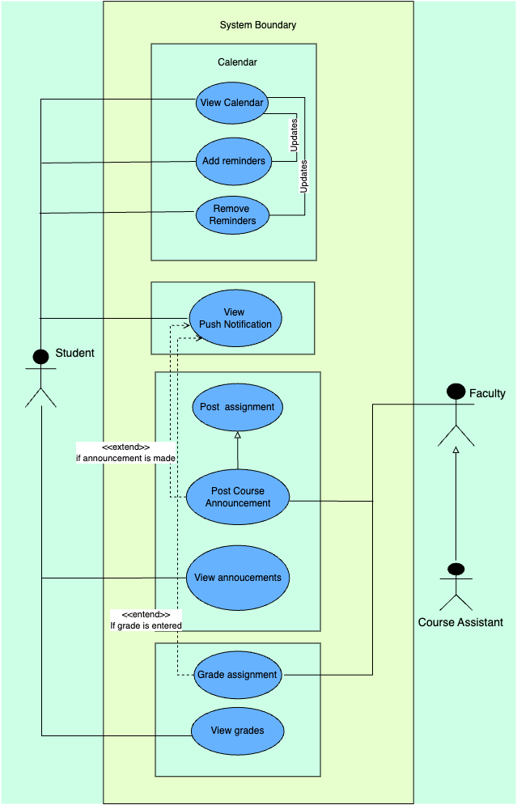
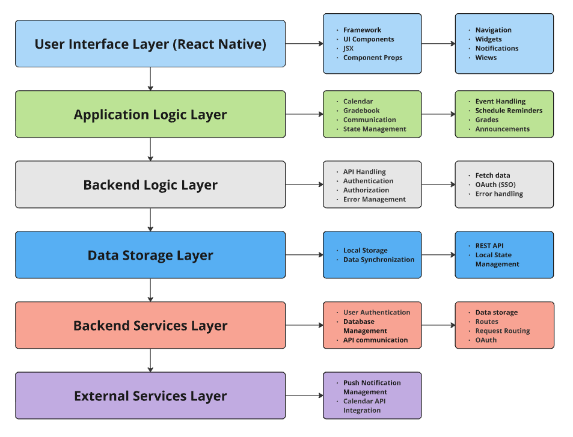

# Diagrams

## Use Case Diagram

*This Use Case Diagram shows the interactions between students, faculty, and course assistants, focusing on calendar management, announcements, and grading within the One Stop Shop system.*

## Domain Model

*This Domain Model visualizes the relationships between students, faculty, course assistants, and various components of the One Stop Shop system, including assignments, announcements, calendars, and notifications.*

## Sequence Diagram

*This Sequence Diagram illustrates the interactions between faculty, students, and key system components like the calendar, announcements, assignments, and gradebook. It shows how actions such as posting announcements and assignments trigger notifications and updates across the system.*

## Software Architecture Diagram

*This Software Architecture Diagram shows the different layers of the One Stop Shop system, from the user interface built with React Native down to external services like push notifications and calendar API integration. Each layer handles distinct responsibilities, ensuring efficient data flow and feature functionality across the application.*

## Class Diagram

![One-Stop-Shop Class Diagram](https://mermaid.ink/img/pako:eNqdV1Fv0zAQ_iuRn0B0qN2G2KoJCa0DJrExsSEk1BcvdltriR3FzkYp62_nHMeJ7TqhkJc2d2f7u8-f75wNSgWhaIrSDEs5Y3hZ4nzOE3i-SVomZ78PDpJbVRHKVWj-gNMqU-vQfC6qUtL3UjKpsB7lBAjtxxnlBJeB-U7MxGcYEpivhWILlmLFBLdTNXiSOZrMUQJBc5Rjvob_Zu1kmlBeiiyTCWuGNFiHhiiK0xWVJj5IoguPDsV1nEyemFpZkI3TLCjcYXrWJc9bRgciORcVT-k-sR9LTKhdvFsiknEdCahXWP6NTxta0pSyR0vO4Oy31X3OIEBwGMd4msHcsiWl2ftYAhePtFOLVUMsUPsuFc3bZItCMK4cPCZc__OkOxTYitmE1sfBqHBjLPo5O8P3UpU4Ve_eddaDpIK4y5lr4Tin7jvNMctcQwHzP4mSuDaQrDPoVZKJJeMvXgYmUSnf9sjok3tM5K7b8m49z36eVgAbF01aS01e1CeJEthNvSFbo8CtG7nUKpEQcIWLbSeOkZHPNgRTWwOQjcBuKrlyU_GDYP_xklpp-L57IR6c_e1J1JaBWKJ3uFquVG-ar5JCSOWeyBi4LvsgwaogWNFY6pqSbti5yIuM6ty_QryMrfFlAfTQTxpglESHhhiXASVhpYtRY7yMLwfYkfrcKz_B6FKxFfzDY2zXwRFaNHs39RuPcWKLX_oQ27w8wUqj9za20f82nLHZSRvW7ZIf6Wiii3WMHk-YkG4ef__2EdggwU5h3sRz8YlWTGUexzB1WrLCNFvHXNEZqHF3jyBbw_Ou1GcUk4xx2gfVyTMA63hCXXDVFvMGGax0A7RRsic4zbHPKyUssBAKJ7APuGmJm4icYD2v3YTcgz9s_c34VJQRBm-1ue8o2Ua6CfsQrKLbltd8Hl1l1n02lGRt3OUlYjbkRBxyzdPvcAEK63OAvB7pw67x_acygac75hcKWEWkDBzkvF8HXFfGtWaqB2d7A9mHYQbXkZZgez8JOda2XYp3rYbhXXuOy4f3ciZ6z5Rd2Iessfnk7n_KoXSqSkakWdt7YLhNx4fCHc9eRzvc2ij9ID04C2ErxKSv8ji3QL_wdA4f3OD5HmxLuzkAWPjKIFVGfcAphpKX-Taj0WbamKuB03er627ifrlq7f-Q5h5lTEGiIJi8GNxYe1PoL8KQBhqhnJZwZybwaVqDnyO1gpYwR1P4S-gCAydzNOfPEIorJW6h-qDpAmeSjlAp4CrXvjX9yHzbttYC8x9CeO9oukE_0fRw_Ob10WR8Mp4cTiZHJ6eHJyO0RtPx8wj9qkdMXo_Nc3h8-nYyPj56O0I6AVFeNR_T-uf5DyHGjSE?type=png)

*This Class Diagram outlines the key entities and relationships in the One Stop Shop system, depicting how students, faculty, and course assistants inherit from a common User class and interact with components like courses, assignments, grades, calendars, and notifications.*
