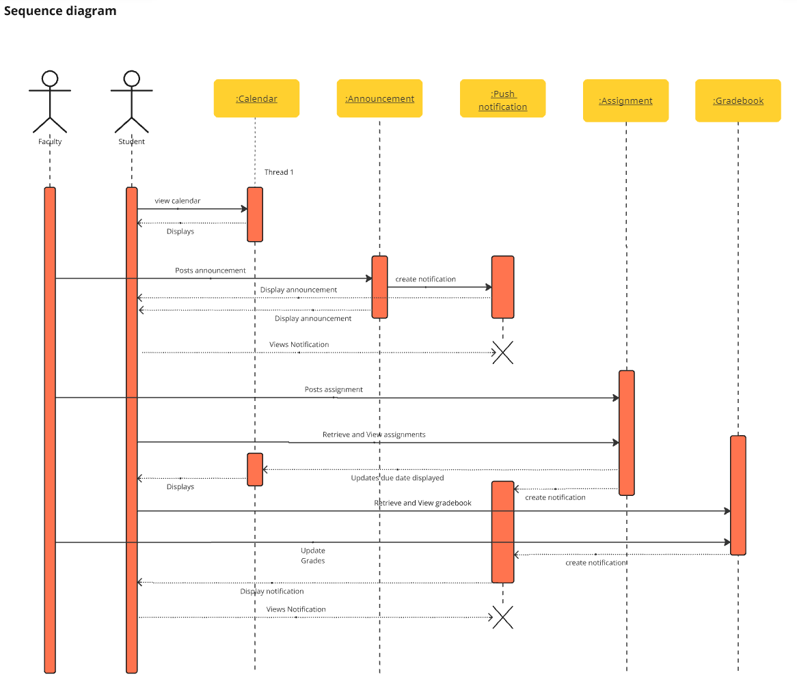
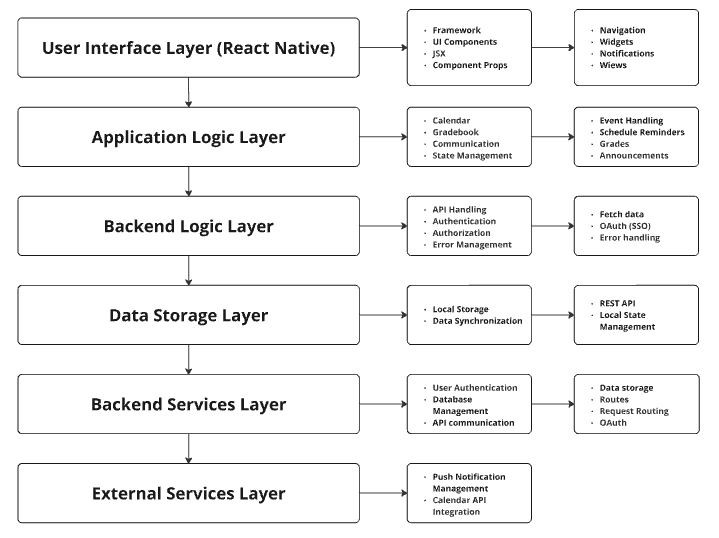

# One Stop Shop

## Introduction

One Stop Shop is an all-in-one mobile application for RIT students, faculty, and course assistants to manage course schedules, assignments, deadlines, grades, and announcements in one place. It aims to integrate the functionalities of MyCourses and other tools into a single, convenient application to enhance productivity and reduce the need for external applications.

## Table of Contents

1. [Executive Summary](#executive-summary)
2. [Requirements](#requirements)
   - [Definition of MVP](#definition-of-mvp)
   - [MVP Features](#mvp-features)
3. [Diagrams](#diagrams)
   - [Use Case Diagram](#use-case-diagram)
   - [Domain Model](#domain-model)
   - [Sequence Diagram](#sequence-diagram)
   - [Software Architecture](#software-architecture)
4. [Team Information](#team-information)

## Executive Summary

RIT students today struggle with keeping track of their course schedules. With the mobile version of MyCourses, Pulse, lacking basic features, as well as having to rely on third-party calendar applications to manage schedules and deadlines, students and faculty do not currently have a single application to solve these problems.

Having one application to manage all course needs for students and faculty would be a tremendous help to those who are currently struggling to manage their time. Students using multiple applications currently often forget to update their external calendars. The announcements relayed by Pulse are often unreliable, leading to students missing announcements and being forced onto the mobile site of MyCourses when they want to see more details.

The One Stop Shop aims to be that single application. With the full functionality of MyCourses and a calendar to help keep track of student schedules, RIT students will no longer have to rely on multiple applications to keep track of deadlines, grades, and other course-related events. Faculty and course assistants will also be able to post announcements and update grades on the go, something not currently possible without navigating the subpar MyCourses mobile site.

## Requirements

### Definition of MVP

The One Stop Shop application seeks to address the shortfalls of RIT’s apps by providing a single, mobile-friendly solution for students, faculty, and course assistants. The app will allow students to manage their schedules, track homework deadlines, and receive course-related notifications. Faculty will have the tools to manage classes, assignments, and interact with students, while course assistants will be able to edit grades directly from the app. Regardless of the user, the full functionality of MyCourses will be available anywhere, with even more features to help create a single application that every student can utilize instead of relying on outside resources. One Stop Shop app provides a user-friendly interface for quick access to course-related tasks. The app enables better communication between students, faculty, and course assistants through announcements, notifications, and scheduling tools.

### MVP Features

#### Epics

#### An easy-to-use and comprehensive calendar page for students and faculty

- **High Priority**: As a student, I want to view a calendar with all of my upcoming assignments and events so I can stay on top of my work
  - *Acceptance Criteria:* The calendar should display all upcoming assignments and events
  - *Acceptance Criteria:* Assignments and Events icons should be intuitive and clear to understand. They should not clutter the workspace

- **Medium Priority**: As a student, I want to add reminders and events to my calendar so I can keep track of off-schedule events
  - *Acceptance Criteria:* Students should be able to add, edit, and delete reminders and events

- **High Priority**: As a student, I want events to be added to my calendar automatically so I can save time and energy
  - *Acceptance Criteria:* Events should appear in the student's calendar automatically after being added to the system
  - *Acceptance Criteria:* After deadlines for HWs/Quizzes/etc are modified, the calendar should appropriately display the updated deadlines

- **Low Priority**: As a student, I want to book office hour appointments with professors through the app so that I can easily schedule meetings
  - *Acceptance Criteria:* Students should be able to see available time slots and book an appointment

- **Low Priority**: As a faculty member, I want to see when students have office hours so I don't double book
  - *Acceptance Criteria:* Faculty should receive a notification when a student books office hours

#### Full functioning MyCourses page for easy mobile use for students, faculty, and course assistants

- **High Priority**: As a student, I want to check my grades in the app so that I can monitor my academic performance
  - *Acceptance Criteria:* Grades should be updated in the app after being posted by faculty
  - *Acceptance Criteria:* Students should be able to quickly navigate to their grades

- **High Priority**: As a faculty member, I want to post course announcements in the app so that my students can receive updates
  - *Acceptance Criteria:* Announcements should be visible to students after being posted
  - *Acceptance Criteria:* Faculty members should be able to create and post announcements on the app

- **High Priority**: As a faculty member, I want to manage homework and assignment deadlines through the app so that students can stay informed
  - *Acceptance Criteria:* Faculty should be able to add, edit, and delete deadlines, and students should be notified of changes

- **Medium Priority**: As a faculty member, I want to quickly see assignment completion rates so I can send reminders accordingly
  - *Acceptance Criteria:* Faculty should be able to view a summary of assignment completion rate metrics
  - *Acceptance Criteria:* Faculty can easily send appropriate reminders to students that haven’t completed the work through the app

- **Medium Priority**: As a course assistant, I want to be able to submit grades on the app so I don't have to open a browser to update grades
  - *Acceptance Criteria:* Grades submitted by course assistants should be reflected in the app for students to view

#### Fully functional TODO for students with a comprehensive notification system

- **High Priority**: As a student, I want to receive push notifications for course announcements so that I don’t miss important updates
  - *Acceptance Criteria:* Push notifications should be sent after an announcement is posted
  - *Acceptance Criteria:* Push notifications should produce a notification sound

- **Low Priority**: As a student, I want to have changes and updates seen in the TODO section of the application reflected on my calendar so I can stay on top of what needs to be done
  - *Acceptance Criteria:* Updates in the TODO section should be synchronized with the calendar

- **Low Priority**: As a student, I want to see a widget notification when my grades are assigned, so that I can see my grades as soon as they are posted
  - *Acceptance Criteria:* Widget notifications should appear after grades are posted
  - *Acceptance Criteria:* Widget notifications should appear at the top of the phone screen as a banner, even if the application is not open

## Diagrams

### Use Case Diagram

### Domain Model

### Sequence Diagram

### Software Architecture

For our architectural stack, we wanted to keep things simple and easy to track so we utilized a common mobile app architecture framework and modified it to conform to the needs of our application.

## Team Information

**Team name:** One Stop Shop

### Team members

- AJ Barea
- Hayden Cabral
- Roman Kozulia
- Ivan Rojas
